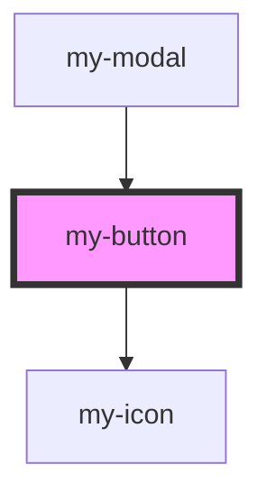

# my-button

<!-- Auto Generated Below -->

## Properties

| Property   | Attribute  | Description | Type                                                     | Default     |
| ---------- | ---------- | ----------- | -------------------------------------------------------- | ----------- |
| `block`    | `block`    |             | `boolean`                                                | `undefined` |
| `disabled` | `disabled` |             | `boolean`                                                | `undefined` |
| `linkUrl`  | `link-url` |             | `string`                                                 | `undefined` |
| `loading`  | `loading`  |             | `boolean`                                                | `undefined` |
| `onClick`  | --         |             | `Function`                                               | `() => { }` |
| `target`   | `target`   |             | `string`                                                 | `'_self'`   |
| `text`     | `text`     |             | `string`                                                 | `undefined` |
| `type`     | `type`     |             | `"dashed" \| "default" \| "link" \| "primary" \| "text"` | `undefined` |

## Dependencies

### Used by

 - [my-modal](../my-modal)

### Depends on

- [my-icon](../my-icon)

### Graph

----------------------------------------------

*Built with [StencilJS](https://stenciljs.com/)*
