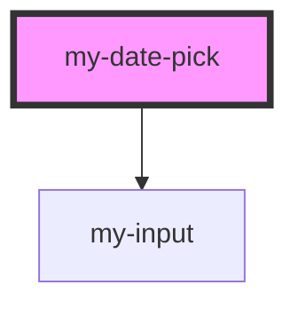

# my-date-pick

<!-- Auto Generated Below -->

## Properties

| Property   | Attribute | Description | Type                          | Default     |
| ---------- | --------- | ----------- | ----------------------------- | ----------- |
| `format`   | `format`  |             | `string`                      | `undefined` |
| `onChange` | --        |             | `(v: Date \| Date[]) => void` | `undefined` |
| `picker`   | `picker`  |             | `"day" \| "month"`            | `'day'`     |
| `value`    | `value`   |             | `string`                      | `undefined` |

## Dependencies

### Depends on

- [my-input](../my-input)

### Graph

----------------------------------------------

*Built with [StencilJS](https://stenciljs.com/)*
