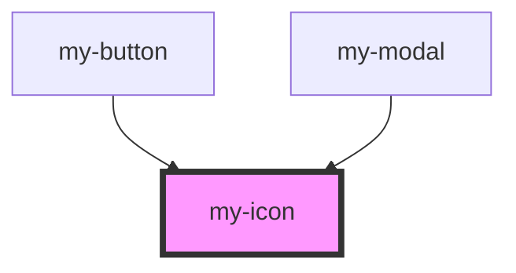

# my-icon

<!-- Auto Generated Below -->

## Properties

| Property | Attribute | Description | Type     | Default     |
| -------- | --------- | ----------- | -------- | ----------- |
| `class`  | `class`   |             | `string` | `undefined` |
| `color`  | `color`   |             | `string` | `undefined` |
| `name`   | `name`    |             | `string` | `undefined` |
| `size`   | `size`    |             | `string` | `undefined` |

## Dependencies

### Used by

 - [my-button](../my-button)
 - [my-modal](../my-modal)

### Graph

----------------------------------------------

*Built with [StencilJS](https://stenciljs.com/)*
