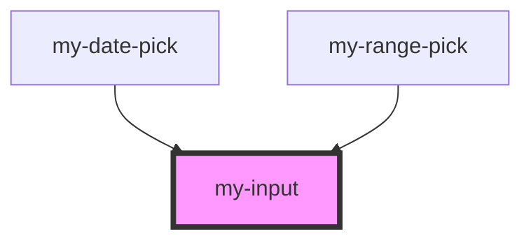

# my-input

<!-- Auto Generated Below -->

## Properties

| Property      | Attribute     | Description | Type                                                                | Default     |
| ------------- | ------------- | ----------- | ------------------------------------------------------------------- | ----------- |
| `editAble`    | `edit-able`   |             | `boolean`                                                           | `undefined` |
| `placeholder` | `placeholder` |             | `string`                                                            | `undefined` |
| `type`        | `type`        |             | `"checkbox" \| "color" \| "date" \| "file" \| "text" \| "textarea"` | `undefined` |
| `value`       | `value`       |             | `number \| string`                                                  | `undefined` |

## Dependencies

### Used by

 - [my-date-pick](../my-date-pick)
 - [my-range-pick](../my-range-pick)

### Graph

----------------------------------------------

*Built with [StencilJS](https://stenciljs.com/)*
