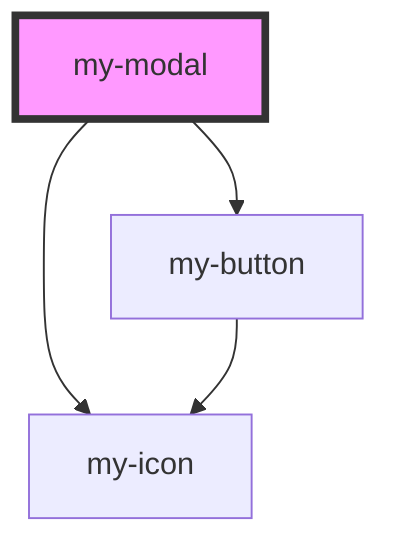

# my-modal

<!-- Auto Generated Below -->

## Properties

| Property      | Attribute      | Description | Type                  | Default     |
| ------------- | -------------- | ----------- | --------------------- | ----------- |
| `close`       | `close`        |             | `boolean`             | `true`      |
| `footerclass` | `footerclass`  |             | `string`              | `undefined` |
| `headerTitle` | `header-title` |             | `string`              | `undefined` |
| `headerclass` | `headerclass`  |             | `string`              | `undefined` |
| `onCancel`    | --             |             | `Function`            | `undefined` |
| `onOk`        | --             |             | `(v: Object) => void` | `undefined` |
| `visible`     | `visible`      |             | `boolean`             | `false`     |

## Dependencies

### Depends on

- [my-icon](../my-icon)
- [my-button](../my-button)

### Graph

----------------------------------------------

*Built with [StencilJS](https://stenciljs.com/)*
