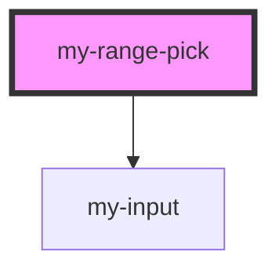

# my-range-pick

<!-- Auto Generated Below -->

## Properties

| Property   | Attribute | Description | Type                      | Default     |
| ---------- | --------- | ----------- | ------------------------- | ----------- |
| `onChange` | --        |             | `(value: Date[]) => void` | `undefined` |
| `value`    | --        |             | `string[]`                | `[]`        |

## Dependencies

### Depends on

- [my-input](../my-input)

### Graph

----------------------------------------------

*Built with [StencilJS](https://stenciljs.com/)*
